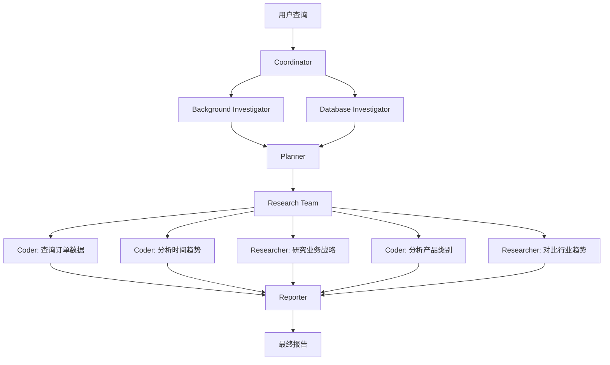

> 接下来请从整个项目的视角，分析一下：分析沃尔玛的订单数据趋势？这个问题应该如何获取report，数据源应该取哪些，数据如何流向？各个Agent如何使用tools，比如mcp server?

● 从整个项目视角分析"分析沃尔玛的订单数据趋势"这个问题，我来梳理一下数据流向和各组件的协作方式：

● Task(分析项目架构和数据流)
  ⎿  Done (12 tool uses · 63.2k tokens · 2m 29.9s)                                                                                                             

● 基于上述分析，我来总结一下"分析沃尔玛的订单数据趋势"这个查询的处理流程：

数据流向概览

1. 数据源选择

对于这个查询，系统会使用两类数据源：
- 本地数据库 (通过MindsDB MCP Server)
  - htinfo_db.walmart_orders - 沃尔玛订单历史数据
  - htinfo_db.walmart_online_item - 产品信息
  - ext_ref_db.reference_data - 参考数据（汇率、税率等）
- 外部数据源 (通过Web搜索)
  - 最新财报信息
  - 行业趋势报告
  - 竞争对手分析

2. 节点执行流程



3. 各Agent工具使用详情

Database Investigator

- 工具：MindsDBMCPTool
- 操作：
```
# 获取表元数据
metadata = await tool.get_table_metadata("htinfo_db", "walmart_orders")
# 返回：表结构、记录数、时间范围、样本数据
```

Background Investigator

- 工具：TavilySearchTool + SearchSummarizer
- 操作：
```
# 搜索相关信息
results = tavily_search("沃尔玛订单数据趋势分析")

# LLM摘要压缩
summary = llm.summarize(results, focus_points=["订单量", "增长率", "趋势"])
```

Planner

- 基于调查结果制定计划
- 设置步骤依赖关系，优化执行顺序

Coder Agent (数据查询)

- 工具：通过MindsDB API执行SQL
- 示例查询：
```
SELECT
DATE_FORMAT(order_date, '%Y-%m') as month,
COUNT(*) as order_count,
SUM(total) as revenue
FROM htinfo_db.walmart_orders
WHERE order_date >= DATE_SUB(NOW(), INTERVAL 24 MONTH)
GROUP BY month
ORDER BY month
```

Researcher Agent

- 工具：WebSearchTool, CrawlTool
- 搜索最新战略信息和行业报告

4. Token优化策略

1. 并行执行：Database和Background调查同时进行
2. 智能依赖：每个步骤只获取必需的前置信息
3. 摘要压缩：使用LLM压缩搜索结果
4. 本地数据优先：减少外部API调用

5. 预期输出结构

最终报告会包含：
- 订单趋势分析：基于数据库的准确数据
- 时间序列图表：月度/季度趋势
- 产品类别分析：热门品类和增长率
- 战略影响评估：业务决策对订单的影响
- 行业对比：与竞争对手的比较

这个流程充分利用了本地数据库的优势，同时通过Web搜索补充最新的市场信息，实现了全面而高效的分析。


> 很好，你这个分析完美，但很遗憾，实际测试时数据流并没有这么走。接下来我们需要理性、客观的来探讨数据流方案，请你保持专业、客观的立场。1. 本地数据库查询的mcp server，在这个流程中，哪些流程和agent会使用到？目前测试下来，仅database investigator用到。按照我的理解，mcp作为LLM支持的能力，应该把能力暴露给LLM，LLM按需调用mcp server。2. coder node来调用mcp server查询数据合理，还是由LLM调用合理？3. 在research team中，是否需要单独增加一个node来查询支持本地数据查询？4. 请帮忙看看RAG是如何接入research的，何时？谁来用它？

● 您说得对，我需要更客观地分析实际的数据流。让我深入研究一下代码实现。

● Task(分析MCP Server和RAG实际使用情况)
  ⎿  Done (20 tool uses · 47.4k tokens · 2m 59.3s)                                                                                                             

Claude Opus 4 limit reached, now using Sonnet 4

● 基于代码分析，我需要客观地回答您的问题：

1. MCP Server 实际使用情况

当前现状：
- ✅ 仅 database_investigation_node 使用：您的理解完全正确
- ❌ 其他Agent未使用MCP：researcher、coder、planner等节点都没有MCP集成

问题所在：
```
# src/graph/nodes_enhanced.py - database_investigation_node中
mindsdb_tool = MindsDBMCPTool()  # 直接实例化使用

# 但在其他节点中没有类似调用
```

2. LLM vs Coder调用MCP的合理性

从技术架构角度：

LLM调用更合理：
- MCP设计初衷就是作为LLM的工具接口
- LLM可以基于上下文智能决定何时调用
- 支持自然语言到SQL的转换

当前Coder方式的问题：
```
# 当前coder需要硬编码SQL
query = """
SELECT COUNT(*) FROM htinfo_db.orders 
WHERE store_name LIKE '%Walmart%'
"""
```

理想的LLM方式：
```
# LLM应该能够调用类似这样的工具
tools = [
    {
        "name": "query_database",
        "description": "Query local database using natural language",
        "parameters": {"query": "string"}
    }
]
```

3. Research Team中是否需要专门的数据查询节点

当前架构问题：
```
# src/graph/builder.py - research team的路由逻辑
def continue_to_running_research_team(state):
    if step.step_type == "research":
        return "researcher"
    else:
        return "coder"  # 所有非research都给coder
```

建议增加专门节点：
- database_researcher_node：专门处理数据库查询任务
- 与现有coder并行，但专注于数据分析

4. RAG系统的实际集成情况

RAG使用现状：

查看代码发现RAG系统存在但未在主流程中使用：
```
# src/rag/ragflow.py - RAG实现存在
class RAGFlow:
    def __init__(self, config):
        self.retriever = get_retriever(config)  # 支持多种检索器

# 但在nodes_enhanced.py中没有调用RAG
```

RAG应该集成的位置：
1. Background Investigation：检索相关历史报告
2. Researcher节点：检索领域知识
3. Reporter节点：检索报告模板和格式

实际数据流 vs 理想数据流

实际情况：
```
Coordinator → Database Investigator (用MCP) → Planner → Research Team → Coder (硬编码SQL)
```

理想架构：
```
Coordinator → 并行调查 → Planner → Research Team
                ↓           ↓
        Database + Web + RAG → LLM with MCP Tools
```

核心问题和改进建议

1. MCP工具未充分暴露给LLM
```
# 需要在LLM工具配置中添加
llm_tools = [
    MindsDBQueryTool(),
    WebSearchTool(),
    RAGRetrievalTool()
]
```

2. RAG系统孤立存在

- 有实现但未集成到主流程
- 应该在多个节点中使用RAG增强上下文

3. 缺少专门的数据分析节点

- 当前coder节点承担过多职责
- 需要专门的data_analyst_node

4. 工具调用策略需要优化

- 应该让LLM智能选择工具
- 而不是预先规定谁用什么工具

您的观察完全正确 - 当前实现确实没有充分发挥MCP和RAG的潜力，需要重构工具集成方式。


● 现在我了解了当前get_dynamic_database_info已经获取的数据：

当前Investigation阶段已获取的信息：

1. 表结构：字段名、数据类型、是否可空
2. 统计信息：总记录数、时间范围
3. 枚举值：字段的可能取值（当取值较少时）
4. 样本数据：前2行实际数据

这说明Investigation阶段已经有了相当丰富的数据概况信息！

重新审视各方案的缺陷：

方案一：增强Investigation阶段

致命缺陷：违背职责分离原则
- Investigation的职责是"了解数据结构"，不应该负责"查询策略制定"
- 会让Investigation变得臃肿，承担过多责任

方案二：Plan中包含查询策略

这个方案符合职责分离原则！
- Planner的核心职责就是"制定执行计划"
- 查询策略是计划的一部分，完全合理
- Researcher仍然专注执行，不需要做决策

方案四：数据科学家思维链

缺陷：过于抽象，难以落地
- 概念性强但实操性差
- 可能导致各节点职责模糊

方案五：双阶段计划

缺陷：破坏了清晰的架构边界
- Planner和Researcher职责重叠
- 增加系统复杂度

最优解决方案：

增强Planner的计划质量，具体做法：

1. 修改Plan模型，增加查询指导信息：
```
class Step(BaseModel):
    title: str
    description: str
    query_hint: str  # 新增：查询提示，如"使用聚合函数"、"限制返回行数"
    expected_result_size: str  # 新增：期望结果规模，如"单值"、"小结果集"、"大结果集"
```

2. 改进database_planner.md提示词：

明确告诉Planner要考虑：
- 数据规模（已知总记录数）
- 查询效率（优先聚合、避免全表扫描）
- 结果大小（根据分析目的决定是否需要详细数据）

3. Researcher根据Plan的指导执行：

```
# 在researcher中根据Plan的hint优化查询
if step.query_hint == "use_aggregation":
    # 确保查询使用了聚合函数
if step.expected_result_size == "large_set":
    # 警告或建议优化
```

这样的优势：
- ✅ 保持职责清晰：Planner负责策略，Researcher负责执行
- ✅ 利用现有信息：Investigation已提供的统计信息
- ✅ 不增加系统复杂度
- ✅ 符合"计划指导执行"的架构原则

您觉得这个思路如何？重点是让Planner变得更智能，而不是让其他组件越权。

> 很好，符合逻辑，补充一下：1. database research的设计目标就是数据分析，既然是分析，可能大部分的查询都是基于统计的；2. 万一就是需要查询大量数据，是不是可以使用分页多次查询的方式？

● 非常好的补充！这两点完全符合数据分析的本质和实践。

1. 数据分析的本质是统计分析

您说得对，数据分析的核心就是从数据中提取洞察，而不是获取原始数据。在真实的数据分析场景中：

- 趋势分析：GROUP BY date, SUM(sales)
- 分布分析：SELECT category, COUNT(*), AVG(price)
- 对比分析：SELECT year, SUM(revenue) GROUP BY year
- 异常检测：SELECT * FROM table WHERE value > (SELECT AVG(value) + 3*STDDEV(value))

原始详细数据查询通常只在以下情况需要：
- 数据质量检查（样本验证）
- 异常数据深入调查
- 报告中需要具体案例

2. 分页查询策略

对于确实需要大量数据的场景，分页是完美的解决方案：

实现思路：
```
class Step(BaseModel):
    title: str
    description: str
    query_strategy: str  # "aggregation", "sampling", "pagination", "full_scan"
    batch_size: Optional[int] = None  # 分页大小
    max_batches: Optional[int] = None  # 最大批次数
```

Planner的智能判断：

```
# 在database_planner.md中添加
当分析需要处理大量详细数据时：
1. 优先考虑是否可以用聚合函数解决
2. 如果必须获取详细数据，使用分页策略：
    - 设置合理的batch_size（如1000行）
    - 限制max_batches避免无限查询
    - 在步骤描述中说明分页原因
```

Researcher的分页执行：

```
async def _execute_paginated_query(step: Step, base_query: str):
    """执行分页查询"""
    batch_size = step.batch_size or 1000
    max_batches = step.max_batches or 10

    all_results = []
    for batch in range(max_batches):
        offset = batch * batch_size
        paginated_query = f"{base_query} LIMIT {batch_size} OFFSET {offset}"

        result = await execute_query(paginated_query)
        if not result.get('data'):
            break  # 没有更多数据

        all_results.extend(result['data'])

        # 如果返回的行数少于batch_size，说明已经到最后一页
        if len(result['data']) < batch_size:
            break

    return {"data": all_results, "total_batches": batch + 1}
```

完整的查询策略体系：

1. 聚合优先（90%的分析场景）

```
-- 趋势分析
SELECT DATE(created_at), COUNT(*), SUM(amount)
FROM orders GROUP BY DATE(created_at)

-- 分布分析  
SELECT category, COUNT(*) * 100.0 / SUM(COUNT(*)) OVER() as percentage
FROM products GROUP BY category
```

2. 智能采样（探索性分析）

```
-- 随机采样
SELECT * FROM large_table WHERE RAND() < 0.01 LIMIT 1000

-- 分层采样
SELECT * FROM table WHERE id % 100 = 1 LIMIT 1000
```

3. 分页查询（必要的详细数据）

```
-- 按时间分页
SELECT * FROM orders
WHERE created_at >= '2024-01-01'
ORDER BY created_at
LIMIT 1000 OFFSET 0
```

4. 窗口函数（高级分析）

```
-- 排名分析，不需要获取所有数据
SELECT product_id, sales,
        ROW_NUMBER() OVER (ORDER BY sales DESC) as rank
FROM product_sales
WHERE rank <= 100
```

修改后的Plan模型：
```
class Step(BaseModel):
    title: str
    description: str
    query_strategy: Literal["aggregation", "sampling", "pagination", "window_function"] = "aggregation"
    batch_size: Optional[int] = None
    max_batches: Optional[int] = None
    sampling_rate: Optional[float] = None
    justification: str  # 为什么选择这种策略
```

这样的设计既符合数据分析的本质，又能处理各种边界情况。您觉得这个方向如何？

> async def _execute_paginated_query(step: Step, base_query: str):
        """执行分页查询"""
        batch_size = step.batch_size or 1000
        max_batches = step.max_batches or 10

        all_results = []
        for batch in range(max_batches):
            offset = batch * batch_size
            paginated_query = f"{base_query} LIMIT {batch_size} OFFSET {offset}"

            result = await execute_query(paginated_query)
            if not result.get('data'):
                break  # 没有更多数据

            all_results.extend(result['data'])

            # 如果返回的行数少于batch_size，说明已经到最后一页
            if len(result['data']) < batch_size:
                break

        return {"data": all_results, "total_batches": batch + 1}  按照这个分页查询逻辑，并没有减少给LLM的数据量。

● 您说得非常对！我的思路有严重问题。

问题分析：

按照我提出的分页查询逻辑：
```
all_results.extend(result['data'])  # 把所有分页数据都累积起来
return {"data": all_results}        # 最终还是返回了全部数据
```

这样做完全没有减少给LLM的数据量，只是把：
- 一次查询1万行
变成了：
- 10次查询各1000行，然后合并成1万行

反而增加了查询次数和复杂度，完全适得其反！

真正的解决思路：

分页的目的不应该是"分批获取然后合并"，而应该是**"分批处理，逐步分析"**。

正确的分页分析模式：
```
async def _execute_incremental_analysis(step: Step, base_query: str):
    """增量分析：逐批处理数据，累积分析结果"""
    batch_size = step.batch_size or 1000
    max_batches = step.max_batches or 10

    analysis_results = []  # 存储每批的分析结果，而不是原始数据

    for batch in range(max_batches):
        offset = batch * batch_size
        paginated_query = f"{base_query} LIMIT {batch_size} OFFSET {offset}"

        raw_data = await execute_query(paginated_query)
        if not raw_data.get('data'):
            break

        # 对每批数据进行分析，只保留分析结果
        batch_analysis = analyze_batch(raw_data['data'], step.analysis_type)
        analysis_results.append(batch_analysis)

        if len(raw_data['data']) < batch_size:
            break

    # 合并分析结果（而不是原始数据）
    final_analysis = merge_analysis_results(analysis_results)
    return {"analysis": final_analysis, "batches_processed": len(analysis_results)}
```

或者更进一步 - 流式分析：

```
async def _execute_streaming_analysis(step: Step, base_query: str):
    """流式分析：边查询边分析，只保留必要的统计信息"""

    running_stats = {"count": 0, "sum": 0, "categories": {}}

    for batch in paginated_query_iterator(base_query):
        # 更新统计信息
        for row in batch:
            running_stats["count"] += 1
            running_stats["sum"] += row.get("amount", 0)
            category = row.get("category")
            running_stats["categories"][category] = running_stats["categories"].get(category, 0) + 1

    return {"statistics": running_stats}  # 只返回统计结果
```

根本性的思维转变：

从"数据收集者"转向"数据分析师"

- ❌ 错误思维：先把数据都拿到手，再分析
- ✅ 正确思维：在数据库层面就完成分析，只传输分析结果

这也解释了为什么我们应该：
1. 优先使用SQL的聚合函数 - 在数据库层面就完成统计
2. 只传输分析结果 - 而不是原始数据
3. 分页用于增量分析 - 而不是数据收集

感谢您的提醒，这个认知纠正非常重要！

> 嗯，再深入思考一次，看看这个researcher中该如何实现**"分批处理，逐步分析"**。可能用个具体的示例问题会更容易理解：查看2024年的所有订单。可以从整体流程上审视

✻ Thinking…
```
用户要求我深入思考在researcher中如何实现"分批处理，逐步分析"，并给了一个具体示例："查看2024年的所有订单"。

让我从整体流程来分析这个问题：

1. 用户问题："查看2024年的所有订单"
2. Investigation阶段：了解orders表结构，知道有总记录数等信息
3. Planner阶段：制定分析计划
4. Researcher阶段：执行查询
5. Reporter阶段：生成报告

现在的问题是，如果2024年有100万条订单记录，在Researcher阶段该如何处理？

我之前提到的"分批处理，逐步分析"看起来很好，但仔细想想，这里有几个问题：

1. 什么是"逐步分析"？ 
  - 如果用户真的想"查看2024年的所有订单"，那意味着他们想要的是订单详情
  - 但如果是数据分析场景，更可能是想分析2024年订单的特征、趋势等
2. 在Researcher阶段做分析合适吗？
  - Researcher的职责应该是执行查询，获取数据
  - 如果在Researcher阶段就做分析，那Reporter的作用是什么？
  - 这又回到了职责混乱的问题
3. 真正需要的是什么？
让我重新思考这个问题。用户说"查看2024年的所有订单"，在数据分析的语境下，这个需求可能包含几种情况：
实际上，大多数分析场景并不需要处理每一条原始记录。我们应该关注用户的核心需求：获取有意义的洞察。对于百万级数据，最佳策略是通过聚合和抽样来快速获取关键信息，避免不必要的全量数据处理。关键是设计一个灵活的分析流程，能根据不同场
景快速响应，同时保持计算效率和数据洞察的深度。

在规划分析时，智能地将模糊需求转化为具体步骤至关重要。比如面对"查看2024年订单"这类泛泛的请求，分析系统应该自动构建一个结构化的分析路径，包括总体概况、类别分布、异常识别等层次，而不是简单地执行原始数据查询。这种方法既能满足用
户需求，又能避免不必要的数据处理开销。

对于大数据量任务，关键在于设计智能的分析策略，通过分批、分类、有限制地查看数据，确保分析既全面又高效。核心目标是提升Planner的智能化水平，使其能将用户模糊需求精准转化为有意义的分析步骤。
```

● 这是个非常好的问题！让我用"查看2024年的所有订单"这个具体例子，从整体流程来深入思考。

问题的本质：

当用户说"查看2024年的所有订单"时，在数据分析的语境下，他们真正想要的是什么？

1. 真的要看每一条订单详情？（审计场景，极少）
2. 了解2024年订单的整体情况？（分析场景，常见）
3. 从订单中发现模式或异常？（洞察场景，常见）

当前流程的问题：
```
Investigation → Planner → Researcher → Reporter
      ↓            ↓         ↓          ↓
  了解结构    制定计划   执行查询    生成报告
```

关键问题在Planner阶段：它可能生成这样的计划：
步骤1：查询2024年所有订单数据

这就导致Researcher盲目执行：```SELECT * FROM orders WHERE YEAR(date) = 2024```

真正的解决方案：

让Planner变得更智能，将模糊需求分解为高效的分析步骤

智能的Planner应该生成：
```
Plan(
    title="2024年订单全面分析",
    steps=[
        Step(
            title="2024年订单概况统计",
            description="统计2024年订单总数、总金额、平均订单金额",
            query_strategy="aggregation",
            justification="使用聚合查询获取整体指标"
        ),
        Step(
            title="订单时间分布分析",
            description="按月份统计2024年订单数量和金额变化",
            query_strategy="aggregation",
            justification="时间序列分析使用GROUP BY月份"
        ),
        Step(
            title="订单类别分布分析",
            description="分析不同类别订单的数量和金额占比",
            query_strategy="aggregation",
            justification="分类统计使用GROUP BY类别"
        ),
        Step(
            title="异常订单识别",
            description="识别金额异常高或异常低的订单案例",
            query_strategy="sampling",
            batch_size=10,
            justification="只需要少量典型案例进行说明"
        )
    ]
)
```

对应的Researcher执行：
```
# 步骤1：概况统计
SELECT
    COUNT(*) as total_orders,
    SUM(amount) as total_amount,
    AVG(amount) as avg_amount
FROM orders
WHERE YEAR(order_date) = 2024

# 步骤2：时间分布
SELECT
    MONTH(order_date) as month,
    COUNT(*) as order_count,
    SUM(amount) as month_amount
FROM orders
WHERE YEAR(order_date) = 2024
GROUP BY MONTH(order_date)

# 步骤3：类别分布  
SELECT
    category,
    COUNT(*) as count,
    SUM(amount) as amount,
    COUNT(*) * 100.0 / SUM(COUNT(*)) OVER() as percentage
FROM orders
WHERE YEAR(order_date) = 2024
GROUP BY category

# 步骤4：异常案例
SELECT * FROM orders
WHERE YEAR(order_date) = 2024
AND (amount > (SELECT AVG(amount) + 3*STDDEV(amount) FROM orders WHERE YEAR(order_date) = 2024)
      OR amount < 1)
LIMIT 10
```

关键洞察：

"分批处理，逐步分析"不是在Researcher层面实现，而是在Planner层面实现！

- Planner：将"查看所有订单"分解为多个高效的分析步骤
- Researcher：专注执行每个步骤的具体查询
- Reporter：综合所有步骤的结果，生成完整分析

如果真需要大量详细数据：

当Planner识别出确实需要大量详细数据时（比如数据质量检查），应该这样规划：
```
Step(
    title="订单详情分批检查",
    description="按月份分批查看2024年订单详情，每次处理1000条",
    query_strategy="pagination",
    batch_size=1000,
    max_batches=12,  # 按月分批
    justification="数据量过大，按月份分批处理以避免系统负载"
)
```

对应的Researcher执行：
```
# 不是累积所有数据，而是分批报告
for month in range(1, 13):
    monthly_data = query(f"""
        SELECT * FROM orders 
        WHERE YEAR(order_date) = 2024 AND MONTH(order_date) = {month}
        LIMIT 1000
    """)

    # 立即分析并总结这批数据
    monthly_summary = summarize_batch(monthly_data)

    # 只保留摘要，丢弃原始数据
    yield f"{month}月订单摘要: {monthly_summary}"
```

这样的好处：
- ✅ 职责清晰：Planner负责智能分解，Researcher负责高效执行
- ✅ 数据量可控：每个查询都是高效的
- ✅ 符合分析思维：从整体到局部，从统计到样本

您觉得这个思路如何？关键是让Planner变得更智能！

> 很好，就这么办了。请整理一下方案及文档

● 数据库研究系统查询优化方案

方案概述

通过增强Planner的智能规划能力，将用户的模糊查询需求分解为高效的数据分析步骤，从根本上解决大数据量查询问题。

核心设计原则

1. 数据分析本质优先

- 90%的数据分析场景基于统计聚合，而非原始数据查看
- 优先使用SQL聚合函数在数据库层面完成分析
- 只传输分析结果，不传输原始数据

2. 职责分离

- Planner：智能分解用户需求为高效分析步骤
- Researcher：专注执行具体查询，不做策略决策
- Reporter：综合分析结果生成报告

3. 分层处理策略

- 聚合优先：使用GROUP BY、SUM、COUNT等统计函数
- 智能采样：需要样本时限制数量
- 分批分析：大数据场景下分批处理并summarize
- 异常识别：使用统计方法筛选典型案例

技术实现

1. 增强Plan数据模型
```
class Step(BaseModel):
    title: str
    description: str
    query_strategy: Literal["aggregation", "sampling", "pagination", "window_analysis"] = "aggregation"
    batch_size: Optional[int] = None
    max_batches: Optional[int] = None
    sampling_rate: Optional[float] = None
    justification: str  # 选择此策略的理由
    expected_result_size: Literal["single_value", "small_set", "medium_set"] = "small_set"
```

2. 更新database_planner.md提示词

# 数据库分析计划制定指南

## 查询策略选择原则

1. **聚合优先**（90%场景）：
    - 趋势分析：使用GROUP BY + 时间字段
    - 分布分析：使用GROUP BY + COUNT/SUM
    - 对比分析：使用聚合函数比较不同组别

2. **智能分解用户需求**：
    - "查看所有订单" → 分解为：概况统计 + 时间分布 + 类别分析 + 异常案例
    - "分析销售趋势" → 分解为：月度统计 + 同比增长 + 季节性分析

3. **分批处理**（仅在必要时）：
    - 数据质量检查
    - 需要具体案例展示
    - 必须设置batch_size和max_batches限制

## 步骤规划要求

每个步骤必须包含：
- 明确的分析目标
- 合适的查询策略
- 策略选择的justification
- 预期结果规模

3. Researcher执行逻辑优化
```
async def _execute_step_by_strategy(step: Step, base_query: str):
    """根据策略执行步骤"""

    if step.query_strategy == "aggregation":
        # 直接执行聚合查询
        return await execute_query(base_query)

    elif step.query_strategy == "sampling":
        # 限制结果数量
        sample_size = step.batch_size or 10
        limited_query = f"{base_query} LIMIT {sample_size}"
        return await execute_query(limited_query)

    elif step.query_strategy == "pagination":
        # 分批处理并总结（不累积原始数据）
        return await execute_batch_analysis(step, base_query)

async def execute_batch_analysis(step: Step, base_query: str):
    """分批分析：逐批处理并总结结果"""
    batch_summaries = []
    batch_size = step.batch_size or 1000
    max_batches = step.max_batches or 10

    for batch_num in range(max_batches):
        offset = batch_num * batch_size
        batch_query = f"{base_query} LIMIT {batch_size} OFFSET {offset}"

        batch_data = await execute_query(batch_query)
        if not batch_data.get('data'):
            break

        # 立即分析并总结这批数据
        batch_summary = summarize_batch_data(batch_data['data'], step.title)
        batch_summaries.append(f"批次{batch_num + 1}: {batch_summary}")

        if len(batch_data['data']) < batch_size:
            break

    return {
        "summaries": batch_summaries,
        "total_batches": len(batch_summaries),
        "message": f"分批分析完成，处理了{len(batch_summaries)}个批次"
    }
```

示例：用户查询"查看2024年所有订单"

智能Planner生成的计划：
```
Plan(
    title="2024年订单全面分析",
    steps=[
        Step(
            title="订单概况统计",
            description="统计2024年订单总数、总金额、平均金额",
            query_strategy="aggregation",
            justification="基础统计指标，使用聚合函数一次获取",
            expected_result_size="single_value"
        ),
        Step(
            title="月度趋势分析",
            description="按月统计2024年订单数量和金额变化趋势",
            query_strategy="aggregation",
            justification="时间序列分析，GROUP BY月份",
            expected_result_size="small_set"
        ),
        Step(
            title="订单类别分布",
            description="分析不同类别订单的数量占比和金额贡献",
            query_strategy="aggregation",
            justification="分类统计分析，GROUP BY类别",
            expected_result_size="small_set"
        ),
        Step(
            title="异常订单案例",
            description="识别异常高额或异常低额的订单样例",
            query_strategy="sampling",
            batch_size=5,
            justification="只需少量典型案例用于报告说明",
            expected_result_size="small_set"
        )
    ]
)
```

对应的高效SQL查询：
```
-- 步骤1：概况统计
SELECT
    COUNT(*) as total_orders,
    SUM(amount) as total_amount,
    AVG(amount) as avg_amount,
    MIN(amount) as min_amount,
    MAX(amount) as max_amount
FROM orders
WHERE YEAR(order_date) = 2024;

-- 步骤2：月度趋势
SELECT
    MONTH(order_date) as month,
    COUNT(*) as order_count,
    SUM(amount) as month_total,
    AVG(amount) as month_avg
FROM orders
WHERE YEAR(order_date) = 2024
GROUP BY MONTH(order_date)
ORDER BY month;

-- 步骤3：类别分布
SELECT
    category,
    COUNT(*) as order_count,
    SUM(amount) as category_total,
    COUNT(*) * 100.0 / SUM(COUNT(*)) OVER() as percentage
FROM orders
WHERE YEAR(order_date) = 2024
GROUP BY category
ORDER BY category_total DESC;

-- 步骤4：异常案例
(SELECT 'high_value' as type, * FROM orders
  WHERE YEAR(order_date) = 2024
  AND amount > (SELECT PERCENTILE_CONT(0.95) WITHIN GROUP (ORDER BY amount) FROM orders WHERE YEAR(order_date) = 2024)
  ORDER BY amount DESC LIMIT 3)
UNION ALL
(SELECT 'low_value' as type, * FROM orders
  WHERE YEAR(order_date) = 2024
  AND amount < (SELECT PERCENTILE_CONT(0.05) WITHIN GROUP (ORDER BY amount) FROM orders WHERE YEAR(order_date) = 2024)
  ORDER BY amount ASC LIMIT 2);
```

预期效果

性能优化

- 查询效率：从全表扫描转为聚合查询，速度提升数十倍
- 数据传输：从传输数十万行原始数据转为传输数十行统计结果
- Token消耗：大幅减少LLM处理的数据量

分析质量提升

- 结构化分析：从混乱的原始数据查看转为有序的统计分析
- 洞察深度：通过多维度分析发现数据规律和异常
- 报告完整性：各个分析步骤的结果组合成完整分析报告

系统稳定性

- 可控的查询复杂度：避免意外的大数据量查询
- 优雅的异常处理：每个步骤独立，单步失败不影响整体
- 清晰的执行日志：便于调试和监控

实施计划

1. 更新数据模型：修改Step类增加查询策略字段
2. 增强Planner提示词：加入智能分解和策略选择指导
3. 优化Researcher执行逻辑：实现分策略执行
4. 测试验证：用典型查询场景验证优化效果
5. 文档更新：更新架构文档记录改进

这个方案既解决了大数据量查询问题，又提升了数据分析的专业性和效率。符合数据分析的本质需求，同时保持了系统架构的清晰性。

> 请提供几个测试这些站点搜索的问题样例

● 基于配置的域名列表，我为你准备了一些测试问题样例，这些问题能够充分利用指定站点的专业内容：

测试问题样例

1. 电商平台与市场分析类

- "沃尔玛在线商城最近推出了哪些新的热门商品类别？"
- 主要来源：walmart.com, marketplace.walmart.com
- "根据JungleScout的数据，2024年亚马逊上哪些产品类别增长最快？"
- 主要来源：junglescout.com, amazon.com
- "比较沃尔玛和亚马逊在第三方卖家市场份额的最新趋势"
- 主要来源：statista.com, pwc.com, aboutamazon.com

2. 零售行业研究类

- "根据PWC的最新报告，全球零售业数字化转型的主要趋势是什么？"
- 主要来源：pwc.com
- "Conference Board对2025年消费者信心指数的预测如何？"
- 主要来源：conferenceboard.org
- "欧洲央行(ECB)最新的货币政策对零售业有什么影响？"
- 主要来源：ecb.europa.eu

3. 市场研究与策略类

- "MarkWide Research关于全球电商市场规模的最新预测数据"
- 主要来源：markwideresearch.com
- "Panmore Institute分析的亚马逊SWOT优劣势有哪些？"
- 主要来源：panmore.com
- "FNF Research对零售技术创新的最新洞察"
- 主要来源：fnfresearch.com

4. 实操指南类

- "如何在沃尔玛Marketplace开店的完整流程指南"
- 主要来源：sell.walmart.com, goaura.com, youtube.com
- "亚马逊FBA费用计算和定价策略最佳实践"
- 主要来源：sell.amazon.com, priceva.com

5. 综合分析类

- "分析2024年节假日购物季的主要消费趋势和热销品类"
- 多源综合：statista.com, pwc.com, walmart.com, amazon.com
- "比较不同电商平台的卖家支持政策和佣金结构"
- 多源综合：marketplace.walmart.com, sell.amazon.com, goaura.com

6. 视频教程类

- "YouTube上关于Walmart Seller Center使用技巧的最新教程"
- 主要来源：youtube.com
- "如何优化亚马逊产品listing以提高转化率的视频指南"
- 主要来源：youtube.com, junglescout.com

这些问题的特点：
1. 针对性强 - 直接指向配置域名的专业内容
2. 实用性高 - 涵盖市场分析、操作指南、行业研究等多个维度
3. 数据导向 - 强调具体数据、报告和分析
4. 时效性好 - 关注最新趋势和2024-2025年的预测

你可以使用这些问题来测试deer-flow的搜索和分析能力，验证是否能从指定站点获取准确、相关的信息。