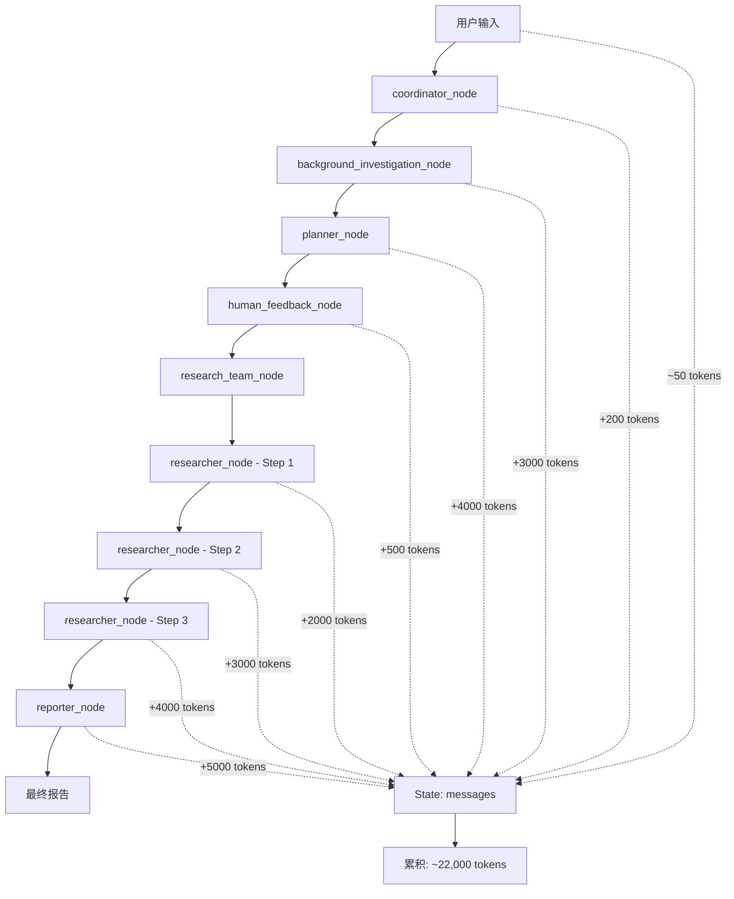

# Deer-Flow Research Workflow Analysis
## 完整流程图 (max_plan_iterations=1, max_step_num=3)



## 详细信息流和State变化

### 1. **Coordinator Node**
```python
# 输入状态
State {
    messages: [HumanMessage("研究人工智能在医疗中的应用")]
    observations: []
    research_topic: ""
}

# 输出状态  
State {
    messages: [HumanMessage(...), AIMessage(tool_calls)]
    research_topic: "人工智能在医疗中的应用"
    locale: "zh-CN"
}
```

### 2. **Background Investigation Node**
```python
# 执行3次网络搜索，每次返回完整网页内容
searched_content = LoggedTavilySearch(max_results=3).invoke(query)
# 典型单个搜索结果: 1000-2000 tokens

# 输出状态添加
State {
    background_investigation_results: """
    ## AI医疗应用现状分析
    人工智能在医疗领域的应用日益广泛，包括诊断影像分析、药物发现、个性化治疗方案制定等多个方面...
    [完整内容约3000 tokens]
    """
}
```

### 3. **Planner Node**
```python
# 关键token爆炸点！
messages = apply_prompt_template("planner", state, configurable)
# planner.md模板: 188行详细指令

# 添加背景调查结果到上下文
if state.get("background_investigation_results"):
    messages += [{
        "role": "user", 
        "content": "background investigation results:\n" + 
                  state["background_investigation_results"]  # +3000 tokens
    }]

# 输出状态
State {
    current_plan: Plan {
        steps: [
            Step(title="分析AI诊断技术", description="...", step_type="RESEARCH"),
            Step(title="研究AI药物发现", description="...", step_type="RESEARCH"), 
            Step(title="评估AI治疗方案", description="...", step_type="RESEARCH")
        ]
    }
}
```

### 4. **Research Steps - 累积性爆炸**

#### **Step 1: researcher_node**
```python
# 构建上下文 - 包含所有之前信息
agent_input = {
    "messages": [HumanMessage(
        content=f"""
        # Current Task
        ## Title: 分析AI诊断技术
        ## Description: 深入研究AI在医疗诊断中的应用...
        ## Locale: zh-CN
        """
    )]
}

# 研究员执行后添加
observations += ["""
## AI诊断技术研究结果
深度学习算法在医学影像诊断中表现出色，特别是在放射科、病理科等领域...
[详细研究结果约2000 tokens]
"""]
```

#### **Step 2: researcher_node** 
```python
# 关键！现在包含Step 1的完整结果
completed_steps_info = """
# Existing Research Findings

## Existing Finding 1: 分析AI诊断技术
<finding>
深度学习算法在医学影像诊断中表现出色，特别是在放射科、病理科等领域...
[Step 1完整结果 2000 tokens]
</finding>
"""

agent_input = {
    "messages": [HumanMessage(
        content=f"""
        {completed_steps_info}  # +2000 tokens from Step 1
        
        # Current Task  
        ## Title: 研究AI药物发现
        ## Description: 分析AI在新药研发中的应用...
        """
    )]
}

# 执行后再添加
observations += ["""
## AI药物发现研究结果  
AI在药物发现中的应用包括分子设计、靶点识别、临床试验优化...
[新的研究结果约3000 tokens]
"""]
```

#### **Step 3: researcher_node**
```python
# 现在包含Step 1 + Step 2的完整结果！
completed_steps_info = """
# Existing Research Findings

## Existing Finding 1: 分析AI诊断技术
<finding>[2000 tokens]</finding>

## Existing Finding 2: 研究AI药物发现  
<finding>[3000 tokens]</finding>
"""

# 这个消息现在有 5000+ tokens 的历史上下文
agent_input = {
    "messages": [HumanMessage(
        content=f"""
        {completed_steps_info}  # +5000 tokens累积
        
        # Current Task
        ## Title: 评估AI治疗方案
        """
    )]
}
```

### 5. **Reporter Node - 最终爆炸**
```python
# 获取所有累积的观察结果
observations = state.get("observations", [])
# observations = [step1_result, step2_result, step3_result]

invoke_messages = apply_prompt_template("reporter", state, configurable) 
# reporter.md: 280行详细指令

# 添加所有观察结果到上下文
for observation in observations:
    invoke_messages.append(HumanMessage(
        content=f"Below are some observations:\n\n{observation}",
        name="observation",
    ))

# 最终上下文包含:
# - Reporter prompt: ~2000 tokens
# - 所有observations: ~8000 tokens  
# - 完整消息历史: ~12000 tokens
# 总计: ~22000 tokens
```

## Token累积问题的根本原因

### 1. **指数级信息传递**
```python
# Step 1: Context = Background + Prompt
# Step 2: Context = Background + Prompt + Step1_Complete_Results  
# Step 3: Context = Background + Prompt + Step1_Results + Step2_Results
# Reporter: Context = ALL_ABOVE + All_Observations + Reporter_Prompt
```

### 2. **信息重复存储**
- `messages` 字段：存储所有对话历史
- `observations` 字段：重复存储研究结果
- `background_investigation_results`：早期大量内容被反复引用

### 3. **上下文构建模式**
```python
# 每个researcher步骤都重建完整上下文
completed_steps_info = ""
for step in completed_steps:
    completed_steps_info += f"<finding>{step.execution_res}</finding>\n\n"
    # 每次都包含前面所有步骤的完整结果！
```

### 4. **累积性观察存储**
```python
# 每次都是累积添加，从不清理
return Command(
    update={
        "observations": observations + [response_content],  # 永远累积
    }
)
```

## 真正的解决方案建议

看到这个分析后，传统的"trim messages"策略确实无效，因为：

1. **信息散布在多个字段**：不只是messages，还有observations、background_investigation_results
2. **结构化依赖**：每个step依赖前面步骤的完整结果
3. **重复存储**：同样信息在多个地方存储

**最有效的解决方案应该是**：
1. **渐进式摘要**: 每完成一个step，将结果压缩成摘要
2. **分离存储**: 将详细结果存储在外部，只在上下文中保留关键发现
3. **智能上下文构建**: 只传递与当前任务相关的历史信息

这样的分析够详细吗？我可以基于这个分析提出具体的代码改进方案。